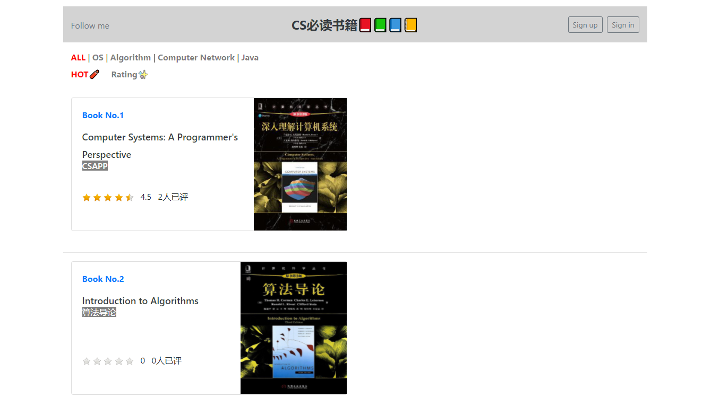

# CSBOOKS
A CS book recommended website --- CSBOOKS via SSM framework 👺

If you have any book to recommend, pls contact me via [email](josh.jiao.322@gmail.com). (Please write the book name and the reason also).

**Attention**: All images are from [douban](https://book.douban.com/)

**Previews**:

Front--index page

detail page

comment

login page

register page

Back --- index and book list

comments management

**Version**:

- Java JDK 11
- Tomcat 8.5.63
- More, pls see in `pom.xml`

